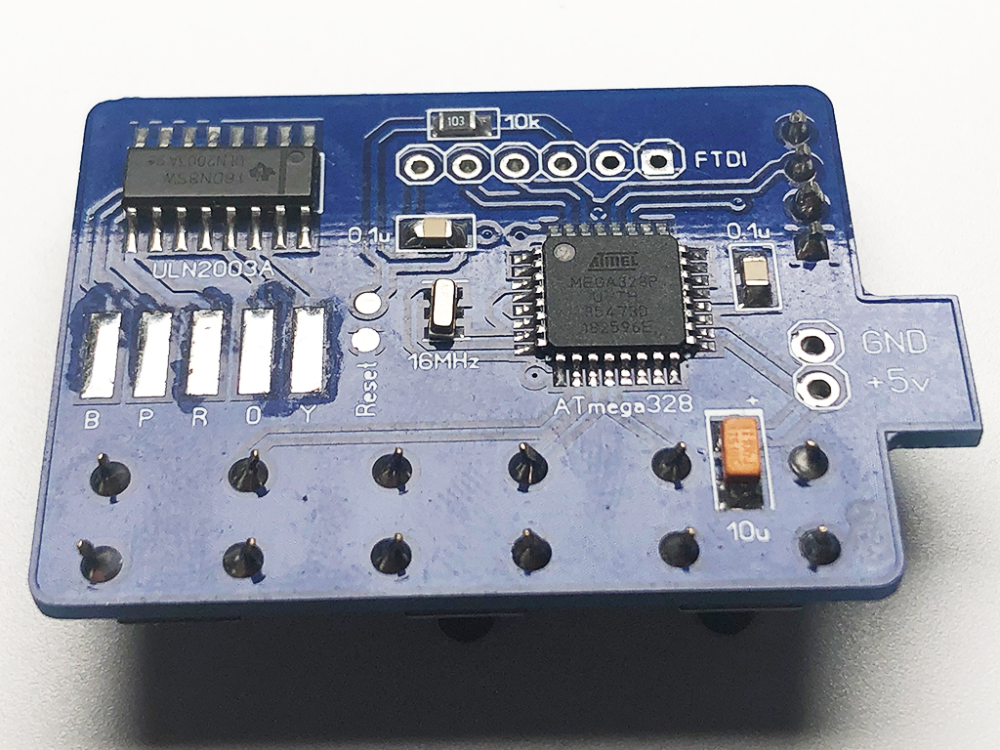

Дозатор флюса и пасты
=====================

Дозатор с экраном для настройки и отображения режима работы.
При выдавливании есть возможность отката, чтобы снималось напряжение и флюс не продолжал течь.

## Плата

Управление:

* При нажатии на **первую кнопку (UP)** происходит выдавливание флюса и откат;
* **Вторая кнопка (DOWN)** отвечает за реверс. Повторное нажатие остановка;
* Чтобы войти в меню удерживается **третья кнопка (MENU)**;

|   Верх                   | Низ
|--------------------------|-----------------------------
|     | 
|  | 

Экран:

* На **первом экране** настраиваются параметры выдавливания: ускорение, скорость и количество шагов с значениями от 0 до 100 и шагом в 5 пунктов. Листается меню третьей кнопкой а изменяются значения первыми двумя;
* На **втором экране** настройки отвечающие за откат. Значения и управление аналогичны выдавливанию;
* Для **сохранения настроек** в память удерживается третья кнопка;

|   Первый экран      |   Настройки         | Настройки
|---------------------|---------------------|----------------------
|  |  | 

#### BOM:

|No|Name|Value|Layer|Comment
|---|---|---|---|---
|1|B1|Button|Top|
|2|B2|Button|Top|
|3|B3|Button|Top|
|4|C1|0.1u|Bottom|0805
|5|C2|0.1u|Bottom|0805
|6|C3|10u|Bottom|Tantal
|7|Q1|16Mhz|Bottom
|8|R1|10k|Bottom|0805
|9|SCREEN|0.91 OLED|Top|I2C 128x32
|10|U1|Atmega328|Bottom|TQFP-32
|11|U2|ULN2003A|Bottom|SO-16

## Корпус

Корпус и поршень с резьбой полностью распечатан на 3D принтере. Есть два варианта крепления платы к корпусу. К первой плата приклеивается на двусторонний скотч или "термоклей", во вторую вставляется. Какой удобнее решайте сами.

|   Полный набор       | Версии корпуса
|----------------------|-----------------------
|  | 

## Прошивка

* Любым программатором загружается bootloader (HEX файл и фьюзы прилагаются). Самой простой вариант прошить через USB Arduino NANO и "сдуть" с нее чип.
* Впаивается чип на плату.
* Заливается INO файл из Arduino IDE (как Arduino NANO) с помощью USB-UART преобразователя (FTDI).

## Контакты

Связаться со мной: info@dementiev.net

##### Лицензия: «Attribution-NonCommercial-ShareAlike» («Атрибуция — Некоммерческое использование — На тех же условиях») 4.0 Всемирная

